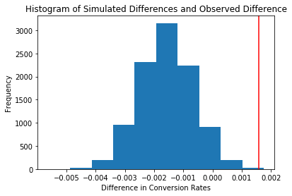

# Analyze A/B Test Results 

This project will assure you have mastered the subjects covered in the statistics lessons. We have organized the current notebook into the following sections: 

- [Introduction](#intro)
- [Part I - Probability](#probability)
- [Part II - A/B Test](#ab_test)
- [Part III - Regression](#regression)
- [Final Check](#finalcheck)
- [Submission](#submission)


<a id='intro'></a>
## Introduction

For this project, I will be working to understand the results of an A/B test run by an e-commerce website.  My goal is to work through this notebook to help the company understand if they should:
- Implement the new webpage, 
- Keep the old webpage, or 
- Perhaps run the experiment longer to make their decision.


<a id='probability'></a>
## Part I - Probability


```python
import pandas as pd
import numpy as np
import random
import matplotlib.pyplot as plt
%matplotlib inline
#We are setting the seed to assure you get the same answers on quizzes as we set up
random.seed(42)
```

### ToDo 1.1
Now, read in the `ab_data.csv` data. Store it in `df`. Below is the description of the data, there are a total of 5 columns:

<center>

|Data columns|Purpose|Valid values|
| ------------- |:-------------| -----:|
|user_id|Unique ID|Int64 values|
|timestamp|Time stamp when the user visited the webpage|-|
|group|In the current A/B experiment, the users are categorized into two broad groups. <br>The `control` group users are expected to be served with `old_page`; and `treatment` group users are matched with the `new_page`. <br>However, **some inaccurate rows** are present in the initial data, such as a `control` group user is matched with a `new_page`. |`['control', 'treatment']`|
|landing_page|It denotes whether the user visited the old or new webpage.|`['old_page', 'new_page']`|
|converted|It denotes whether the user decided to pay for the company's product. Here, `1` means yes, the user bought the product.|`[0, 1]`|
</center>
Use your dataframe to answer the questions in Quiz 1 of the classroom.


>**Tip**: Please save your work regularly.

**a.** Read in the dataset from the `ab_data.csv` file and take a look at the top few rows here:


```python
df = pd.read_csv('ab_data.csv')
df.head()
```


<div>
<style scoped>
    .dataframe tbody tr th:only-of-type {
        vertical-align: middle;
    }

    .dataframe tbody tr th {
        vertical-align: top;
    }

    .dataframe thead th {
        text-align: right;
    }
</style>
<table border="1" class="dataframe">
  <thead>
    <tr style="text-align: right;">
      <th></th>
      <th>user_id</th>
      <th>timestamp</th>
      <th>group</th>
      <th>landing_page</th>
      <th>converted</th>
    </tr>
  </thead>
  <tbody>
    <tr>
      <th>0</th>
      <td>851104</td>
      <td>2017-01-21 22:11:48.556739</td>
      <td>control</td>
      <td>old_page</td>
      <td>0</td>
    </tr>
    <tr>
      <th>1</th>
      <td>804228</td>
      <td>2017-01-12 08:01:45.159739</td>
      <td>control</td>
      <td>old_page</td>
      <td>0</td>
    </tr>
    <tr>
      <th>2</th>
      <td>661590</td>
      <td>2017-01-11 16:55:06.154213</td>
      <td>treatment</td>
      <td>new_page</td>
      <td>0</td>
    </tr>
    <tr>
      <th>3</th>
      <td>853541</td>
      <td>2017-01-08 18:28:03.143765</td>
      <td>treatment</td>
      <td>new_page</td>
      <td>0</td>
    </tr>
    <tr>
      <th>4</th>
      <td>864975</td>
      <td>2017-01-21 01:52:26.210827</td>
      <td>control</td>
      <td>old_page</td>
      <td>1</td>
    </tr>
  </tbody>
</table>
</div>


**b.** Use the cell below to find the number of rows in the dataset.


```python
df.shape
```


    (294478, 5)


**c.** The number of unique users in the dataset.


```python
df.user_id.nunique()
```


    290584


**d.** The proportion of users converted.


```python
df.query('converted == "1"').user_id.nunique()/df.user_id.nunique()
```


    0.12104245244060237


**e.** The number of times when the "group" is `treatment` but "landing_page" is not a `new_page`.


```python
df.query('group == "treatment" and landing_page == "old_page"').timestamp.nunique()
```


    1965


**f.** Do any of the rows have missing values?


```python
df.isnull().sum()
```


    user_id         0
    timestamp       0
    group           0
    landing_page    0
    converted       0
    dtype: int64


### ToDo 1.2  
In a particular row, the **group** and **landing_page** columns should have either of the following acceptable values:

|user_id| timestamp|group|landing_page|converted|
|---|---|---|---|---|
|XXXX|XXXX|`control`| `old_page`|X |
|XXXX|XXXX|`treatment`|`new_page`|X |


It means, the `control` group users should match with `old_page`; and `treatment` group users should matched with the `new_page`. 

However, for the rows where `treatment` does not match with `new_page` or `control` does not match with `old_page`, we cannot be sure if such rows truly received the new or old wepage.  


**a.** Store the new dataframe in **df2**.


```python
# Remove the inaccurate rows, and store the result in a new dataframe df2
control_mask = (df['group']=='control') & (df['landing_page']=='new_page')
treatment_mask = (df['group']=='treatment') & (df['landing_page']=='old_page')
df2 = df[~(control_mask | treatment_mask)]
df2
```


<div>
<style scoped>
    .dataframe tbody tr th:only-of-type {
        vertical-align: middle;
    }

    .dataframe tbody tr th {
        vertical-align: top;
    }

    .dataframe thead th {
        text-align: right;
    }
</style>
<table border="1" class="dataframe">
  <thead>
    <tr style="text-align: right;">
      <th></th>
      <th>user_id</th>
      <th>timestamp</th>
      <th>group</th>
      <th>landing_page</th>
      <th>converted</th>
    </tr>
  </thead>
  <tbody>
    <tr>
      <th>0</th>
      <td>851104</td>
      <td>2017-01-21 22:11:48.556739</td>
      <td>control</td>
      <td>old_page</td>
      <td>0</td>
    </tr>
    <tr>
      <th>1</th>
      <td>804228</td>
      <td>2017-01-12 08:01:45.159739</td>
      <td>control</td>
      <td>old_page</td>
      <td>0</td>
    </tr>
    <tr>
      <th>2</th>
      <td>661590</td>
      <td>2017-01-11 16:55:06.154213</td>
      <td>treatment</td>
      <td>new_page</td>
      <td>0</td>
    </tr>
    <tr>
      <th>3</th>
      <td>853541</td>
      <td>2017-01-08 18:28:03.143765</td>
      <td>treatment</td>
      <td>new_page</td>
      <td>0</td>
    </tr>
    <tr>
      <th>4</th>
      <td>864975</td>
      <td>2017-01-21 01:52:26.210827</td>
      <td>control</td>
      <td>old_page</td>
      <td>1</td>
    </tr>
    <tr>
      <th>5</th>
      <td>936923</td>
      <td>2017-01-10 15:20:49.083499</td>
      <td>control</td>
      <td>old_page</td>
      <td>0</td>
    </tr>
    <tr>
      <th>6</th>
      <td>679687</td>
      <td>2017-01-19 03:26:46.940749</td>
      <td>treatment</td>
      <td>new_page</td>
      <td>1</td>
    </tr>
    <tr>
      <th>7</th>
      <td>719014</td>
      <td>2017-01-17 01:48:29.539573</td>
      <td>control</td>
      <td>old_page</td>
      <td>0</td>
    </tr>
    <tr>
      <th>8</th>
      <td>817355</td>
      <td>2017-01-04 17:58:08.979471</td>
      <td>treatment</td>
      <td>new_page</td>
      <td>1</td>
    </tr>
    <tr>
      <th>9</th>
      <td>839785</td>
      <td>2017-01-15 18:11:06.610965</td>
      <td>treatment</td>
      <td>new_page</td>
      <td>1</td>
    </tr>
    <tr>
      <th>10</th>
      <td>929503</td>
      <td>2017-01-18 05:37:11.527370</td>
      <td>treatment</td>
      <td>new_page</td>
      <td>0</td>
    </tr>
    <tr>
      <th>11</th>
      <td>834487</td>
      <td>2017-01-21 22:37:47.774891</td>
      <td>treatment</td>
      <td>new_page</td>
      <td>0</td>
    </tr>
    <tr>
      <th>12</th>
      <td>803683</td>
      <td>2017-01-09 06:05:16.222706</td>
      <td>treatment</td>
      <td>new_page</td>
      <td>0</td>
    </tr>
    <tr>
      <th>13</th>
      <td>944475</td>
      <td>2017-01-22 01:31:09.573836</td>
      <td>treatment</td>
      <td>new_page</td>
      <td>0</td>
    </tr>
    <tr>
      <th>14</th>
      <td>718956</td>
      <td>2017-01-22 11:45:11.327945</td>
      <td>treatment</td>
      <td>new_page</td>
      <td>0</td>
    </tr>
    <tr>
      <th>15</th>
      <td>644214</td>
      <td>2017-01-22 02:05:21.719434</td>
      <td>control</td>
      <td>old_page</td>
      <td>1</td>
    </tr>
    <tr>
      <th>16</th>
      <td>847721</td>
      <td>2017-01-17 14:01:00.090575</td>
      <td>control</td>
      <td>old_page</td>
      <td>0</td>
    </tr>
    <tr>
      <th>17</th>
      <td>888545</td>
      <td>2017-01-08 06:37:26.332945</td>
      <td>treatment</td>
      <td>new_page</td>
      <td>1</td>
    </tr>
    <tr>
      <th>18</th>
      <td>650559</td>
      <td>2017-01-24 11:55:51.084801</td>
      <td>control</td>
      <td>old_page</td>
      <td>0</td>
    </tr>
    <tr>
      <th>19</th>
      <td>935734</td>
      <td>2017-01-17 20:33:37.428378</td>
      <td>control</td>
      <td>old_page</td>
      <td>0</td>
    </tr>
    <tr>
      <th>20</th>
      <td>740805</td>
      <td>2017-01-12 18:59:45.453277</td>
      <td>treatment</td>
      <td>new_page</td>
      <td>0</td>
    </tr>
    <tr>
      <th>21</th>
      <td>759875</td>
      <td>2017-01-09 16:11:58.806110</td>
      <td>treatment</td>
      <td>new_page</td>
      <td>0</td>
    </tr>
    <tr>
      <th>23</th>
      <td>793849</td>
      <td>2017-01-23 22:36:10.742811</td>
      <td>treatment</td>
      <td>new_page</td>
      <td>0</td>
    </tr>
    <tr>
      <th>24</th>
      <td>905617</td>
      <td>2017-01-20 14:12:19.345499</td>
      <td>treatment</td>
      <td>new_page</td>
      <td>0</td>
    </tr>
    <tr>
      <th>25</th>
      <td>746742</td>
      <td>2017-01-23 11:38:29.592148</td>
      <td>control</td>
      <td>old_page</td>
      <td>0</td>
    </tr>
    <tr>
      <th>26</th>
      <td>892356</td>
      <td>2017-01-05 09:35:14.904865</td>
      <td>treatment</td>
      <td>new_page</td>
      <td>1</td>
    </tr>
    <tr>
      <th>27</th>
      <td>773302</td>
      <td>2017-01-12 08:29:49.810594</td>
      <td>treatment</td>
      <td>new_page</td>
      <td>0</td>
    </tr>
    <tr>
      <th>28</th>
      <td>913579</td>
      <td>2017-01-24 09:11:39.164256</td>
      <td>control</td>
      <td>old_page</td>
      <td>1</td>
    </tr>
    <tr>
      <th>29</th>
      <td>736159</td>
      <td>2017-01-06 01:50:21.318242</td>
      <td>treatment</td>
      <td>new_page</td>
      <td>0</td>
    </tr>
    <tr>
      <th>30</th>
      <td>690284</td>
      <td>2017-01-13 17:22:57.182769</td>
      <td>control</td>
      <td>old_page</td>
      <td>0</td>
    </tr>
    <tr>
      <th>...</th>
      <td>...</td>
      <td>...</td>
      <td>...</td>
      <td>...</td>
      <td>...</td>
    </tr>
    <tr>
      <th>294448</th>
      <td>776137</td>
      <td>2017-01-12 05:53:12.386730</td>
      <td>treatment</td>
      <td>new_page</td>
      <td>0</td>
    </tr>
    <tr>
      <th>294449</th>
      <td>883344</td>
      <td>2017-01-22 23:15:58.645325</td>
      <td>treatment</td>
      <td>new_page</td>
      <td>0</td>
    </tr>
    <tr>
      <th>294450</th>
      <td>825594</td>
      <td>2017-01-06 12:37:08.897784</td>
      <td>treatment</td>
      <td>new_page</td>
      <td>0</td>
    </tr>
    <tr>
      <th>294451</th>
      <td>875688</td>
      <td>2017-01-14 07:19:49.042869</td>
      <td>control</td>
      <td>old_page</td>
      <td>0</td>
    </tr>
    <tr>
      <th>294452</th>
      <td>927527</td>
      <td>2017-01-12 10:52:11.084740</td>
      <td>control</td>
      <td>old_page</td>
      <td>0</td>
    </tr>
    <tr>
      <th>294453</th>
      <td>789177</td>
      <td>2017-01-17 18:17:56.215378</td>
      <td>control</td>
      <td>old_page</td>
      <td>0</td>
    </tr>
    <tr>
      <th>294454</th>
      <td>937338</td>
      <td>2017-01-19 03:23:22.236666</td>
      <td>treatment</td>
      <td>new_page</td>
      <td>0</td>
    </tr>
    <tr>
      <th>294455</th>
      <td>733101</td>
      <td>2017-01-23 12:52:58.711914</td>
      <td>treatment</td>
      <td>new_page</td>
      <td>0</td>
    </tr>
    <tr>
      <th>294456</th>
      <td>679096</td>
      <td>2017-01-02 16:43:49.237940</td>
      <td>treatment</td>
      <td>new_page</td>
      <td>0</td>
    </tr>
    <tr>
      <th>294457</th>
      <td>691699</td>
      <td>2017-01-09 23:42:35.963486</td>
      <td>treatment</td>
      <td>new_page</td>
      <td>0</td>
    </tr>
    <tr>
      <th>294458</th>
      <td>807595</td>
      <td>2017-01-22 10:43:09.285426</td>
      <td>treatment</td>
      <td>new_page</td>
      <td>0</td>
    </tr>
    <tr>
      <th>294459</th>
      <td>924816</td>
      <td>2017-01-20 10:59:03.481635</td>
      <td>control</td>
      <td>old_page</td>
      <td>0</td>
    </tr>
    <tr>
      <th>294460</th>
      <td>846225</td>
      <td>2017-01-16 15:24:46.705903</td>
      <td>treatment</td>
      <td>new_page</td>
      <td>0</td>
    </tr>
    <tr>
      <th>294461</th>
      <td>740310</td>
      <td>2017-01-10 17:22:19.762612</td>
      <td>control</td>
      <td>old_page</td>
      <td>0</td>
    </tr>
    <tr>
      <th>294462</th>
      <td>677163</td>
      <td>2017-01-03 19:41:51.902148</td>
      <td>treatment</td>
      <td>new_page</td>
      <td>0</td>
    </tr>
    <tr>
      <th>294463</th>
      <td>832080</td>
      <td>2017-01-19 13:18:27.352570</td>
      <td>control</td>
      <td>old_page</td>
      <td>0</td>
    </tr>
    <tr>
      <th>294464</th>
      <td>834362</td>
      <td>2017-01-17 01:51:56.106436</td>
      <td>control</td>
      <td>old_page</td>
      <td>0</td>
    </tr>
    <tr>
      <th>294465</th>
      <td>925675</td>
      <td>2017-01-07 20:38:26.346410</td>
      <td>treatment</td>
      <td>new_page</td>
      <td>0</td>
    </tr>
    <tr>
      <th>294466</th>
      <td>923948</td>
      <td>2017-01-09 16:33:41.104573</td>
      <td>control</td>
      <td>old_page</td>
      <td>0</td>
    </tr>
    <tr>
      <th>294467</th>
      <td>857744</td>
      <td>2017-01-05 08:00:56.024226</td>
      <td>control</td>
      <td>old_page</td>
      <td>0</td>
    </tr>
    <tr>
      <th>294468</th>
      <td>643562</td>
      <td>2017-01-02 19:20:05.460595</td>
      <td>treatment</td>
      <td>new_page</td>
      <td>0</td>
    </tr>
    <tr>
      <th>294469</th>
      <td>755438</td>
      <td>2017-01-18 17:35:06.149568</td>
      <td>control</td>
      <td>old_page</td>
      <td>0</td>
    </tr>
    <tr>
      <th>294470</th>
      <td>908354</td>
      <td>2017-01-11 02:42:21.195145</td>
      <td>control</td>
      <td>old_page</td>
      <td>0</td>
    </tr>
    <tr>
      <th>294471</th>
      <td>718310</td>
      <td>2017-01-21 22:44:20.378320</td>
      <td>control</td>
      <td>old_page</td>
      <td>0</td>
    </tr>
    <tr>
      <th>294472</th>
      <td>822004</td>
      <td>2017-01-04 03:36:46.071379</td>
      <td>treatment</td>
      <td>new_page</td>
      <td>0</td>
    </tr>
    <tr>
      <th>294473</th>
      <td>751197</td>
      <td>2017-01-03 22:28:38.630509</td>
      <td>control</td>
      <td>old_page</td>
      <td>0</td>
    </tr>
    <tr>
      <th>294474</th>
      <td>945152</td>
      <td>2017-01-12 00:51:57.078372</td>
      <td>control</td>
      <td>old_page</td>
      <td>0</td>
    </tr>
    <tr>
      <th>294475</th>
      <td>734608</td>
      <td>2017-01-22 11:45:03.439544</td>
      <td>control</td>
      <td>old_page</td>
      <td>0</td>
    </tr>
    <tr>
      <th>294476</th>
      <td>697314</td>
      <td>2017-01-15 01:20:28.957438</td>
      <td>control</td>
      <td>old_page</td>
      <td>0</td>
    </tr>
    <tr>
      <th>294477</th>
      <td>715931</td>
      <td>2017-01-16 12:40:24.467417</td>
      <td>treatment</td>
      <td>new_page</td>
      <td>0</td>
    </tr>
  </tbody>
</table>
<p>290585 rows × 5 columns</p>
</div>


```python
# Double Check all of the incorrect rows were removed from df2 - 
# Output of the statement below should be 0
df2[((df2['group'] == 'treatment') == (df2['landing_page'] == 'new_page')) == False].shape[0]
```


    0


### ToDo 1.3  
Use **df2** and the cells below to answer questions for **Quiz 3** in the classroom.

**a.** How many unique **user_id**s are in **df2**?


```python
df2.user_id.nunique()
```


    290584


**b.** There is one **user_id** repeated in **df2**.  What is it?


```python
df2[df2.user_id.duplicated()]
```


<div>
<style scoped>
    .dataframe tbody tr th:only-of-type {
        vertical-align: middle;
    }

    .dataframe tbody tr th {
        vertical-align: top;
    }

    .dataframe thead th {
        text-align: right;
    }
</style>
<table border="1" class="dataframe">
  <thead>
    <tr style="text-align: right;">
      <th></th>
      <th>user_id</th>
      <th>timestamp</th>
      <th>group</th>
      <th>landing_page</th>
      <th>converted</th>
    </tr>
  </thead>
  <tbody>
    <tr>
      <th>2893</th>
      <td>773192</td>
      <td>2017-01-14 02:55:59.590927</td>
      <td>treatment</td>
      <td>new_page</td>
      <td>0</td>
    </tr>
  </tbody>
</table>
</div>


**c.** Display the rows for the duplicate **user_id**? 


```python
df2[df2['user_id']==773192]
```


<div>
<style scoped>
    .dataframe tbody tr th:only-of-type {
        vertical-align: middle;
    }

    .dataframe tbody tr th {
        vertical-align: top;
    }

    .dataframe thead th {
        text-align: right;
    }
</style>
<table border="1" class="dataframe">
  <thead>
    <tr style="text-align: right;">
      <th></th>
      <th>user_id</th>
      <th>timestamp</th>
      <th>group</th>
      <th>landing_page</th>
      <th>converted</th>
    </tr>
  </thead>
  <tbody>
    <tr>
      <th>1899</th>
      <td>773192</td>
      <td>2017-01-09 05:37:58.781806</td>
      <td>treatment</td>
      <td>new_page</td>
      <td>0</td>
    </tr>
    <tr>
      <th>2893</th>
      <td>773192</td>
      <td>2017-01-14 02:55:59.590927</td>
      <td>treatment</td>
      <td>new_page</td>
      <td>0</td>
    </tr>
  </tbody>
</table>
</div>


**d.** Remove **one** of the rows with a duplicate **user_id**, from the **df2** dataframe.


```python
# Remove one of the rows with a duplicate user_id..
# Hint: The dataframe.drop_duplicates() may not work in this case because the rows with duplicate user_id are not entirely identical. 
df2.drop(labels=1899, inplace=True)
# Check again if the row with a duplicate user_id is deleted or not
df2[df2['user_id']==773192]
```

    /opt/conda/lib/python3.6/site-packages/pandas/core/frame.py:3697: SettingWithCopyWarning: 
    A value is trying to be set on a copy of a slice from a DataFrame
    
    See the caveats in the documentation: http://pandas.pydata.org/pandas-docs/stable/indexing.html#indexing-view-versus-copy
      errors=errors)


<div>
<style scoped>
    .dataframe tbody tr th:only-of-type {
        vertical-align: middle;
    }

    .dataframe tbody tr th {
        vertical-align: top;
    }

    .dataframe thead th {
        text-align: right;
    }
</style>
<table border="1" class="dataframe">
  <thead>
    <tr style="text-align: right;">
      <th></th>
      <th>user_id</th>
      <th>timestamp</th>
      <th>group</th>
      <th>landing_page</th>
      <th>converted</th>
    </tr>
  </thead>
  <tbody>
    <tr>
      <th>2893</th>
      <td>773192</td>
      <td>2017-01-14 02:55:59.590927</td>
      <td>treatment</td>
      <td>new_page</td>
      <td>0</td>
    </tr>
  </tbody>
</table>
</div>


### ToDo 1.4  
Use **df2** in the cells below to answer the quiz questions related to **Quiz 4** in the classroom.

**a.** What is the probability of an individual converting regardless of the page they receive?<br><br>

>**Tip**: The probability  you'll compute represents the overall "converted" success rate in the population and you may call it $p_{population}$.


```python
coverted_id = df2.query('converted == "1"').user_id.nunique()
total_id = df2.user_id.nunique()
Ppopulation = coverted_id / total_id
Ppopulation 
```


    0.11959708724499628


**b.** Given that an individual was in the `control` group, what is the probability they converted?


```python
coverted_control = df2.query('converted == "1" and group == "control"').user_id.nunique()
control_id = df2.query('group == "control"').user_id.nunique()
Pcontrol = coverted_control/control_id
Pcontrol
```


    0.1203863045004612


**c.** Given that an individual was in the `treatment` group, what is the probability they converted?


```python
coverted_treatment = df2.query('converted == "1" and group == "treatment"').user_id.nunique()
treatment_id = df2.query('group == "treatment"').user_id.nunique()
Ptreatment = coverted_treatment/treatment_id
Ptreatment
```


    0.11880806551510564


>**Tip**: The probabilities you've computed in the points (b). and (c). above can also be treated as conversion rate. 
Calculate the actual difference  (`obs_diff`) between the conversion rates for the two groups. You will need that later.  


```python
# Calculate the actual difference (obs_diff) between the conversion rates for the two groups.
obs_diff = Pcontrol - Ptreatment
obs_diff
```


    0.0015782389853555567


**d.** What is the probability that an individual received the new page?


```python
new_id = df2.query('landing_page == "new_page"').user_id.nunique()
Pnew_page = new_id/total_id
Pnew_page
```


    0.5000619442226688


**e.** Consider your results from parts (a) through (d) above, and explain below whether the new `treatment` group users lead to more conversions.

>**Given these results, the observed difference in conversion rates between the control group and the treatment group is very small (0.0016), indicating that the new treatment group users do not lead to significantly more conversions compared to the control group. This difference is very minor and might not have practical significance.**

<a id='ab_test'></a>
## Part II - A/B Test

Since a timestamp is associated with each event, we could run a hypothesis test continuously as long as you observe the events. 

However, then the questions would be: 
- Do we stop as soon as one page is considered significantly better than another or does it need to happen consistently for a certain amount of time?  
- How long do we run to render a decision that neither page is better than another?  

  

For now, consider to make the decision just based on all the data provided.  


Null Hypothesis (𝐻0):
The null hypothesis asserts that the old page is equal to or better than the new page in terms of the conversion rate.
<center>
        𝐻0: 𝑝𝑛𝑒𝑤 ≤ 𝑝𝑜𝑙𝑑
 </center>
 <br>
Alternative Hypothesis (𝐻1):
The alternative hypothesis states that the new page is definitely better than the old page in terms of the conversion rate.
<center>
      𝐻1: 𝑝𝑛𝑒𝑤 > 𝑝𝑜𝑙𝑑.
</center>

### ToDo 2.2 - Null Hypothesis $H_0$ Testing
Under the null hypothesis $H_0$, assume that $p_{new}$ and $p_{old}$ are equal. Furthermore, assume that $p_{new}$ and $p_{old}$ both are equal to the **converted** success rate in the `df2` data regardless of the page. So, our assumption is: <br><br>
<center>
$p_{new}$ = $p_{old}$ = $p_{population}$
</center>

In this section, I will: 

- Simulate (bootstrap) sample data set for both groups, and compute the  "converted" probability $p$ for those samples. 


- Use a sample size for each group equal to the ones in the `df2` data.


- Compute the difference in the "converted" probability for the two samples above. 


- Perform the sampling distribution for the "difference in the converted probability" between the two simulated-samples over 10,000 iterations; and calculate an estimate. 


Use the cells below to provide the necessary parts of this simulation.  You can use **Quiz 5** in the classroom to make sure you are on the right track.

**a.** What is the **conversion rate** for $p_{new}$ under the null hypothesis? 


```python
p_new = df2['converted'].mean()
p_new
```


    0.11959708724499628


**b.** What is the **conversion rate** for $p_{old}$ under the null hypothesis? 


```python
p_old = df2['converted'].mean()
p_old
```


    0.11959708724499628


**c.** What is $n_{new}$, the number of individuals in the treatment group? <br><br>
*Hint*: The treatment group users are shown the new page.


```python
n_new = len(df2.query("landing_page == 'new_page'"))
n_new
```


    145310


**d.** What is $n_{old}$, the number of individuals in the control group?


```python
n_old = len(df2.query("landing_page == 'old_page'"))
n_old
```


    145274


**e. Simulate Sample for the `treatment` Group**<br> 
Simulate $n_{new}$ transactions with a conversion rate of $p_{new}$ under the null hypothesis.  <br><br>
*Hint*: Use `numpy.random.choice()` method to randomly generate $n_{new}$ number of values. <br>
Store these $n_{new}$ 1's and 0's in the `new_page_converted` numpy array.


```python
# Simulate a Sample for the treatment Group
new_page_converted = np.random.choice([0,1], n_new, p_new)
```

**f. Simulate Sample for the `control` Group** <br>
Simulate $n_{old}$ transactions with a conversion rate of $p_{old}$ under the null hypothesis. <br> Store these $n_{old}$ 1's and 0's in the `old_page_converted` numpy array.


```python
# Simulate a Sample for the control Group
old_page_converted = np.random.choice([0,1], n_old, p_old)
```

**g.** Find the difference in the "converted" probability $(p{'}_{new}$ - $p{'}_{old})$ for your simulated samples from the parts (e) and (f) above. 


```python
new_page_converted.mean() - old_page_converted.mean()
```


    0.0010050759001961618


**h. Sampling distribution** <br>
Re-create `new_page_converted` and `old_page_converted` and find the $(p{'}_{new}$ - $p{'}_{old})$ value 10,000 times using the same simulation process you used in parts (a) through (g) above. 

<br>
Store all  $(p{'}_{new}$ - $p{'}_{old})$  values in a NumPy array called `p_diffs`.


```python
# Sampling distribution 
p_diffs = []
for _ in range(10000):
    b_samp = df2.sample(df.shape[0], replace=True)
    control_df = b_samp.query('group == "control"')
    treatment_df = b_samp.query('group == "treatment"')
    control_ctr = control_df.query('converted == "1"').user_id.nunique()/control_df.user_id.nunique()
    treatment_ctr = treatment_df.query('converted == "1"').user_id.nunique()/treatment_df.user_id.nunique()
    p_diffs.append(treatment_ctr - control_ctr)
```

**i. Histogram**<br> 
Plot a histogram of the **p_diffs**.  Does this plot look like what you expected?  Use the matching problem in the classroom to assure you fully understand what was computed here.<br><br>

Also, use `plt.axvline()` method to mark the actual difference observed  in the `df2` data (recall `obs_diff`), in the chart.  

>**Tip**: Display title, x-label, and y-label in the chart.


```python
plt.hist(p_diffs);
plt.axvline(x=obs_diff, color='red');
plt.title('Histogram of Simulated Differences and Observed Difference')
plt.xlabel('Difference in Conversion Rates')
plt.ylabel('Frequency')
plt.legend()
```





**j.** What proportion of the **p_diffs** are greater than the actual difference observed in the `df2` data?


```python
diffs = np.array(p_diffs)
(diffs > obs_diff).mean()
```


    0.00040000000000000002


**k.** Please explain in words what you have just computed in part **j** above.  
 - What is this value called in scientific studies?  
 - What does this value signify in terms of whether or not there is a difference between the new and old pages? *Hint*: Compare the value above with the "Type I error rate (0.05)". 

>**This value is referred to as the p-value in scientific studies.If the p-value is small, it suggests that the observed difference is unlikely to be explained by random chance alone. This leads to rejecting the null hypothesis.
If the p-value is larger, it implies that the observed difference could probably occur by random chance, and we might not have strong evidence to reject the null hypothesis.
In terms of the Type I error rate (0.05), from the calculations that we have done above, it shows that the p-value(0.0006) is smaller than this significance level. Therefore, it suggests that we have evidence to reject the null hypothesis, indicating that there's a statistically significant difference between the new and old pages.**


**l. Using Built-in Methods for Hypothesis Testing**<br>
We could also use a built-in to achieve similar results.  Though using the built-in might be easier to code, the above portions are a walkthrough of the ideas that are critical to correctly thinking about statistical significance. 

Fill in the statements below to calculate the:
- `convert_old`: number of conversions with the old_page
- `convert_new`: number of conversions with the new_page
- `n_old`: number of individuals who were shown the old_page
- `n_new`: number of individuals who were shown the new_page


```python
import statsmodels.api as sm

# number of conversions with the old_page
convert_old = df2.query('group == "control" and converted == 1').shape[0]

# number of conversions with the new_page
convert_new = df2.query('group == "treatment" and converted == 1').shape[0]

# number of individuals who were shown the old_page
n_old = df2.query('group == "control"').shape[0]

# number of individuals who received new_page
n_new = df2.query('group == "treatment"').shape[0]
```

    /opt/conda/lib/python3.6/site-packages/statsmodels/compat/pandas.py:56: FutureWarning: The pandas.core.datetools module is deprecated and will be removed in a future version. Please use the pandas.tseries module instead.
      from pandas.core import datetools


**m.** Now use `sm.stats.proportions_ztest()` to compute your test statistic and p-value.  [Here](https://www.statsmodels.org/stable/generated/statsmodels.stats.proportion.proportions_ztest.html) is a helpful link on using the built in.

The syntax is: 
```bash
proportions_ztest(count_array, nobs_array, alternative='larger')
```
where, 
- `count_array` = represents the number of "converted" for each group
- `nobs_array` = represents the total number of observations (rows) in each group
- `alternative` = choose one of the values from `[‘two-sided’, ‘smaller’, ‘larger’]` depending upon two-tailed, left-tailed, or right-tailed respectively. 
>**Hint**: <br>
It's a two-tailed if you defined $H_1$ as $(p_{new} = p_{old})$. <br>
It's a left-tailed if you defined $H_1$ as $(p_{new} < p_{old})$. <br>
It's a right-tailed if you defined $H_1$ as $(p_{new} > p_{old})$. 

The built-in function above will return the z_score, p_value. 

---
### About the two-sample z-test
Recall that you have plotted a distribution `p_diffs` representing the
difference in the "converted" probability  $(p{'}_{new}-p{'}_{old})$  for your two simulated samples 10,000 times. 

Another way for comparing the mean of two independent and normal distribution is a **two-sample z-test**. You can perform the Z-test to calculate the Z_score, as shown in the equation below:

$$
Z_{score} = \frac{ (p{'}_{new}-p{'}_{old}) - (p_{new}  -  p_{old})}{ \sqrt{ \frac{\sigma^{2}_{new} }{n_{new}} + \frac{\sigma^{2}_{old} }{n_{old}}  } }
$$

where,
- $p{'}$ is the "converted" success rate in the sample
- $p_{new}$ and $p_{old}$ are the "converted" success rate for the two groups in the population. 
- $\sigma_{new}$ and $\sigma_{new}$ are the standard deviation for the two groups in the population. 
- $n_{new}$ and $n_{old}$ represent the size of the two groups or samples (it's same in our case)


>Z-test is performed when the sample size is large, and the population variance is known. The z-score represents the distance between the two "converted" success rates in terms of the standard error. 

Next step is to make a decision to reject or fail to reject the null hypothesis based on comparing these two values: 
- $Z_{score}$
- $Z_{\alpha}$ or $Z_{0.05}$, also known as critical value at 95% confidence interval.  $Z_{0.05}$ is 1.645 for one-tailed tests,  and 1.960 for two-tailed test. You can determine the $Z_{\alpha}$ from the z-table manually. 

Decide if your hypothesis is either a two-tailed, left-tailed, or right-tailed test. Accordingly, reject OR fail to reject the  null based on the comparison between $Z_{score}$ and $Z_{\alpha}$. 
>Hint:<br>
For a right-tailed test, reject null if $Z_{score}$ > $Z_{\alpha}$. <br>
For a left-tailed test, reject null if $Z_{score}$ < $Z_{\alpha}$. 


In other words, we determine whether or not the $Z_{score}$ lies in the "rejection region" in the distribution. A "rejection region" is an interval where the null hypothesis is rejected iff the $Z_{score}$ lies in that region.


Reference: 
- Example 9.1.2 on this [page](https://stats.libretexts.org/Bookshelves/Introductory_Statistics/Book%3A_Introductory_Statistics_(Shafer_and_Zhang)/09%3A_Two-Sample_Problems/9.01%3A_Comparison_of_Two_Population_Means-_Large_Independent_Samples), courtesy www.stats.libretexts.org

---

>**Tip**: You don't have to dive deeper into z-test for this exercise. **Try having an overview of what does z-score signify in general.** 


```python
import statsmodels.api as sm

z_score, p_value = sm.stats.proportions_ztest([convert_old, convert_new], [n_old, n_new], alternative='larger')
print(z_score, p_value)
```

    1.31092419842 0.094941687241


**n.** What do the z-score and p-value you computed in the previous question mean for the conversion rates of the old and new pages?  Do they agree with the findings in parts **j.** and **k.**?<br><br>


>** The calculated z-score is approximately 1.31, and the calculated p-value is approximately 0.095.The p-value calculated using the z-test (0.095) is similar to the proportion of simulated differences greater than the observed difference (0.0006). Both of these values are much smaller than the typical significance level of 0.05.
This suggests that there is no strong evidence to reject the null hypothesis. In other words, it might fail to reject the null hypothesis, indicating that there isn't enough evidence to conclude that the new page leads to a significantly higher conversion rate compared to the old page..**

<a id='regression'></a>
### Part III - A regression approach


**a.** Since each row in the `df2` data is either a conversion or no conversion, what type of regression should we be performing in this case?

>**In this case, since each row in the df2 data represents either a conversion or no conversion, I should perform logistic regression.**

**b.** The goal is to use **statsmodels** library to fit the regression model we specified in part **a.** above to see if there is a significant difference in conversion based on the page-type a customer receives. However, we first need to create the following two columns in the `df2` dataframe:
 1. `intercept` - It should be `1` in the entire column. 
 2. `ab_page` - It's a dummy variable column, having a value `1` when an individual receives the **treatment**, otherwise `0`.  


```python
df2['intercept'] = 1
df2['ab_page'] = pd.get_dummies(df2['group'])['treatment']
df2.head(1)
```

    /opt/conda/lib/python3.6/site-packages/ipykernel_launcher.py:1: SettingWithCopyWarning: 
    A value is trying to be set on a copy of a slice from a DataFrame.
    Try using .loc[row_indexer,col_indexer] = value instead
    
    See the caveats in the documentation: http://pandas.pydata.org/pandas-docs/stable/indexing.html#indexing-view-versus-copy
      """Entry point for launching an IPython kernel.
    /opt/conda/lib/python3.6/site-packages/ipykernel_launcher.py:2: SettingWithCopyWarning: 
    A value is trying to be set on a copy of a slice from a DataFrame.
    Try using .loc[row_indexer,col_indexer] = value instead
    
    See the caveats in the documentation: http://pandas.pydata.org/pandas-docs/stable/indexing.html#indexing-view-versus-copy
      


<div>
<style scoped>
    .dataframe tbody tr th:only-of-type {
        vertical-align: middle;
    }

    .dataframe tbody tr th {
        vertical-align: top;
    }

    .dataframe thead th {
        text-align: right;
    }
</style>
<table border="1" class="dataframe">
  <thead>
    <tr style="text-align: right;">
      <th></th>
      <th>user_id</th>
      <th>timestamp</th>
      <th>group</th>
      <th>landing_page</th>
      <th>converted</th>
      <th>intercept</th>
      <th>ab_page</th>
    </tr>
  </thead>
  <tbody>
    <tr>
      <th>0</th>
      <td>851104</td>
      <td>2017-01-21 22:11:48.556739</td>
      <td>control</td>
      <td>old_page</td>
      <td>0</td>
      <td>1</td>
      <td>0</td>
    </tr>
  </tbody>
</table>
</div>


**c.** Use **statsmodels** to instantiate the regression model on the two columns in part (b). above, then fit the model to predict whether or not an individual converts. 


```python
import statsmodels.api as sm


x = df2[['intercept', 'ab_page']]
y = df2['converted']

model = sm.Logit(y, x)
results = model.fit()
```

    Optimization terminated successfully.
             Current function value: 0.366118
             Iterations 6


**d.** Provide the summary.


```python
results.summary2()
```


<table class="simpletable">
<tr>
        <td>Model:</td>              <td>Logit</td>       <td>No. Iterations:</td>    <td>6.0000</td>   
</tr>
<tr>
  <td>Dependent Variable:</td>     <td>converted</td>    <td>Pseudo R-squared:</td>    <td>0.000</td>   
</tr>
<tr>
         <td>Date:</td>        <td>2023-12-01 00:25</td>       <td>AIC:</td>        <td>212780.3502</td>
</tr>
<tr>
   <td>No. Observations:</td>       <td>290584</td>            <td>BIC:</td>        <td>212801.5095</td>
</tr>
<tr>
       <td>Df Model:</td>              <td>1</td>         <td>Log-Likelihood:</td>  <td>-1.0639e+05</td>
</tr>
<tr>
     <td>Df Residuals:</td>         <td>290582</td>          <td>LL-Null:</td>      <td>-1.0639e+05</td>
</tr>
<tr>
      <td>Converged:</td>           <td>1.0000</td>           <td>Scale:</td>         <td>1.0000</td>   
</tr>
</table>
<table class="simpletable">
<tr>
      <td></td>       <th>Coef.</th>  <th>Std.Err.</th>     <th>z</th>      <th>P>|z|</th> <th>[0.025</th>  <th>0.975]</th> 
</tr>
<tr>
  <th>intercept</th> <td>-1.9888</td>  <td>0.0081</td>  <td>-246.6690</td> <td>0.0000</td> <td>-2.0046</td> <td>-1.9730</td>
</tr>
<tr>
  <th>ab_page</th>   <td>-0.0150</td>  <td>0.0114</td>   <td>-1.3109</td>  <td>0.1899</td> <td>-0.0374</td> <td>0.0074</td> 
</tr>
</table>


**e.** What is the p-value associated with **ab_page**? Why does it differ from the value we found in **Part II**?<br><br>  


>**ab_page Coefficient: The coefficient for ab_page is approximately -0.0150.
P-value for ab_page: The p-value associated with the ab_page coefficient is approximately 0.1899.
<br>
The p-value for the ab_page coefficient is approximately 0.1899. This p-value is greater than the typical significance level of 0.05, indicating that I would fail to reject the null hypothesis. This suggests that there isn't strong evidence to suggest a significant impact of the page type (old or new) on the conversion rate, as indicated by the coefficient. In Part II, you were conducting a one-sided hypothesis test to determine if the new page's conversion rate is better than the old page's conversion rate.**

**f.** Now, considering other things that might influence whether or not an individual converts.  Discuss why it is a good idea to consider other factors to add into your regression model.  Are there any disadvantages to adding additional terms into the regression model?

>1.Control for Confounding Variables: Including additional factors in the regression model can help control for potential confounding variables.
<br>
2.Improved Model Fit: Including relevant covariates can improve the fit of the model to the data. 
<br>
However, there are also disadvantages.
<br>
1. Overfitting: Adding too many variables to a model can lead to overfitting, where the model becomes too complex and fits the noise in the data rather than the underlying relationships. This can result in poor generalization to new data.
<br>
2.Multicollinearity: Adding correlated variables to the model can lead to multicollinearity, where predictor variables are highly correlated with each other. This can make it difficult to interpret the individual contributions of each variable.

**g. Adding countries**<br> 
Now along with testing if the conversion rate changes for different pages, also add an effect based on which country a user lives in. 


```python
# Read the countries.csv
df3 = pd.read_csv('countries.csv')
```


```python
# Join with the df2 dataframe
df_merged = df2.merge(df3, on='user_id')
```


```python
# Create the necessary dummy variables
dummy_countries = pd.get_dummies(df_merged['country'])
df_merged =pd.concat([df_merged, dummy_countries], axis=1)
df_merged.head()
```


<div>
<style scoped>
    .dataframe tbody tr th:only-of-type {
        vertical-align: middle;
    }

    .dataframe tbody tr th {
        vertical-align: top;
    }

    .dataframe thead th {
        text-align: right;
    }
</style>
<table border="1" class="dataframe">
  <thead>
    <tr style="text-align: right;">
      <th></th>
      <th>user_id</th>
      <th>timestamp</th>
      <th>group</th>
      <th>landing_page</th>
      <th>converted</th>
      <th>intercept</th>
      <th>ab_page</th>
      <th>country</th>
      <th>CA</th>
      <th>UK</th>
      <th>US</th>
    </tr>
  </thead>
  <tbody>
    <tr>
      <th>0</th>
      <td>851104</td>
      <td>2017-01-21 22:11:48.556739</td>
      <td>control</td>
      <td>old_page</td>
      <td>0</td>
      <td>1</td>
      <td>0</td>
      <td>US</td>
      <td>0</td>
      <td>0</td>
      <td>1</td>
    </tr>
    <tr>
      <th>1</th>
      <td>804228</td>
      <td>2017-01-12 08:01:45.159739</td>
      <td>control</td>
      <td>old_page</td>
      <td>0</td>
      <td>1</td>
      <td>0</td>
      <td>US</td>
      <td>0</td>
      <td>0</td>
      <td>1</td>
    </tr>
    <tr>
      <th>2</th>
      <td>661590</td>
      <td>2017-01-11 16:55:06.154213</td>
      <td>treatment</td>
      <td>new_page</td>
      <td>0</td>
      <td>1</td>
      <td>1</td>
      <td>US</td>
      <td>0</td>
      <td>0</td>
      <td>1</td>
    </tr>
    <tr>
      <th>3</th>
      <td>853541</td>
      <td>2017-01-08 18:28:03.143765</td>
      <td>treatment</td>
      <td>new_page</td>
      <td>0</td>
      <td>1</td>
      <td>1</td>
      <td>US</td>
      <td>0</td>
      <td>0</td>
      <td>1</td>
    </tr>
    <tr>
      <th>4</th>
      <td>864975</td>
      <td>2017-01-21 01:52:26.210827</td>
      <td>control</td>
      <td>old_page</td>
      <td>1</td>
      <td>1</td>
      <td>0</td>
      <td>US</td>
      <td>0</td>
      <td>0</td>
      <td>1</td>
    </tr>
  </tbody>
</table>
</div>


**h. Fit the model and obtain the results**<br> 
Though I have now looked at the individual factors of country and page on conversion, I would now like to look at an interaction between page and country to see if are there significant effects on conversion. 


```python
# Fit your model, and summarize the results
import statsmodels.api as sm

X = df_merged[['landing_page', 'CA', 'UK']]  # Corrected line
X['landing_page'] = (X['landing_page'] == 'new_page').astype(int)
X['landing_page_CA'] = X['landing_page'] * X['CA']
X['landing_page_UK'] = X['landing_page'] * X['UK']

X = sm.add_constant(X)
y = df_merged['converted']

model = sm.Logit(y, X)
results = model.fit()
```

    /opt/conda/lib/python3.6/site-packages/ipykernel_launcher.py:5: SettingWithCopyWarning: 
    A value is trying to be set on a copy of a slice from a DataFrame.
    Try using .loc[row_indexer,col_indexer] = value instead
    
    See the caveats in the documentation: http://pandas.pydata.org/pandas-docs/stable/indexing.html#indexing-view-versus-copy
      """
    /opt/conda/lib/python3.6/site-packages/ipykernel_launcher.py:6: SettingWithCopyWarning: 
    A value is trying to be set on a copy of a slice from a DataFrame.
    Try using .loc[row_indexer,col_indexer] = value instead
    
    See the caveats in the documentation: http://pandas.pydata.org/pandas-docs/stable/indexing.html#indexing-view-versus-copy
      
    /opt/conda/lib/python3.6/site-packages/ipykernel_launcher.py:7: SettingWithCopyWarning: 
    A value is trying to be set on a copy of a slice from a DataFrame.
    Try using .loc[row_indexer,col_indexer] = value instead
    
    See the caveats in the documentation: http://pandas.pydata.org/pandas-docs/stable/indexing.html#indexing-view-versus-copy
      import sys


    Optimization terminated successfully.
             Current function value: 0.366109
             Iterations 6


```python
print(results.summary2())
```

                              Results: Logit
    ==================================================================
    Model:              Logit            No. Iterations:   6.0000     
    Dependent Variable: converted        Pseudo R-squared: 0.000      
    Date:               2023-12-01 00:31 AIC:              212782.6602
    No. Observations:   290584           BIC:              212846.1381
    Df Model:           5                Log-Likelihood:   -1.0639e+05
    Df Residuals:       290578           LL-Null:          -1.0639e+05
    Converged:          1.0000           Scale:            1.0000     
    ------------------------------------------------------------------
                      Coef.  Std.Err.     z     P>|z|   [0.025  0.975]
    ------------------------------------------------------------------
    const            -1.9865   0.0096 -206.3440 0.0000 -2.0053 -1.9676
    landing_page     -0.0206   0.0137   -1.5052 0.1323 -0.0473  0.0062
    CA               -0.0175   0.0377   -0.4652 0.6418 -0.0914  0.0563
    UK               -0.0057   0.0188   -0.3057 0.7598 -0.0426  0.0311
    landing_page_CA  -0.0469   0.0538   -0.8718 0.3833 -0.1523  0.0585
    landing_page_UK   0.0314   0.0266    1.1807 0.2377 -0.0207  0.0835
    ==================================================================
    


landing_page coefficient: The p-value for landing_page is 0.1323, which is greater than 0.05 (α). Therefore, we fail to reject the null hypothesis for the landing_page variable. This suggests that there is no significant evidence to claim that the new landing page has a different effect on conversion compared to the old landing page.

CA and UK coefficients: Both CA and UK p-values are greater than 0.05, so we fail to reject the null hypothesis for these country indicators. This implies that there is no significant evidence to suggest that users from Canada (CA) or the UK have significantly different conversion rates compared to users from the US (which is taken as the baseline country).

landing_page_CA and landing_page_UK coefficients: Both interaction term p-values (landing_page_CA and landing_page_UK) are greater than 0.05. Therefore, we fail to reject the null hypothesis for these interaction terms. This implies that the interaction between the landing page and country does not have a significant effect on conversion.

Comment on Effects of Page and Country:
Based on the provided results, neither the new landing page nor the country indicators appear to have a statistically significant effect on conversion. The p-values for these variables and interaction terms are all greater than the typical significance level of 0.05. This suggests that the model does not provide strong evidence to conclude that the type of landing page or the user's country significantly predicts conversion.
